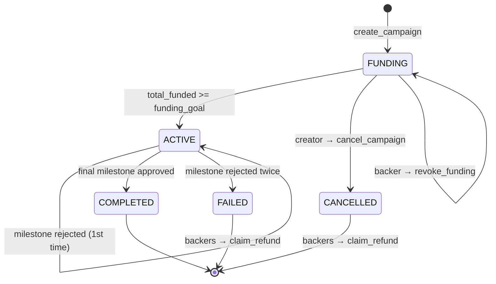
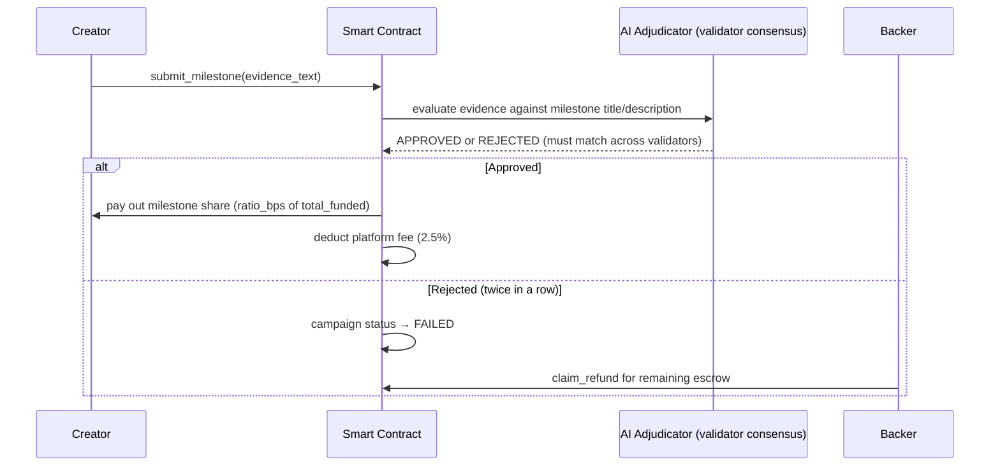

<div align="center">

# 🏛️ PledgeLayer

**On-chain crowdfunding where no human casts the "approve" or "reject" vote.**
Every milestone is judged by an **AI adjudicator**, under validator consensus — not by the campaign creator, and not by a centralized reviewer.

[](https://nextjs.org)
[](https://www.typescriptlang.org)
[](https://tailwindcss.com)
[](https://genlayer.com)
[](https://docs.genlayer.com)

</div>

---

## 🧠 What is PledgeLayer?

Classic crowdfunding platforms share the same structural flaw: once the money is raised, **who actually verifies the creator delivered?** Usually it's either the creator's own word, or a centralized team that isn't much more trustworthy.

**PledgeLayer** breaks that loop. Funds sit escrowed in a smart contract, and each **milestone** is released only after an **LLM-backed Intelligent Contract** — running on [GenLayer](https://genlayer.com) / GenVM — evaluates the creator's submitted evidence, with independent validators voting to reach consensus rather than a single API call deciding unilaterally.

This repo contains two halves:

| Part | File | Description |
|---|---|---|
| 📜 Smart contract | `pledgelayer.py` | Full campaign, funding, adjudication, and refund logic — an Intelligent Contract running on GenVM |
| 🖥️ Frontend | `app/`, `components/`, `lib/` | Dark-mode Web3 dashboard, built with Next.js 14 + `genlayer-js` |

---

## ✨ What makes PledgeLayer different

- **Adjudication without a stake in the outcome** — each milestone's evidence is scored against an impartial adjudication prompt, and the verdict must match across the leader and validator nodes (non-deterministic consensus), not just come from one model call.
- **No stranded funds** — if a campaign is overfunded, the final milestone sweeps the *entire* remaining escrow (not just its nominal share), so no token is ever left locked in the contract.
- **Overfunding-aware payouts** — each milestone's share is computed against `total_funded`, not just `funding_goal`, so surplus contributions get distributed proportionally too.
- **CEI pattern everywhere** — every value transfer (creator payout, platform fee, refund) happens after state is updated, guarding against reentrancy.
- **A safe exit at every stage** — if a campaign never reaches its goal, backers can pull out with `revoke_funding`; if a milestone is rejected twice or a campaign is cancelled, `claim_refund` returns each backer's proportional share of the remaining escrow.
- **Rejection isn't fatal on the first try** — a rejected milestone doesn't fail the campaign outright; the creator gets one more shot at resubmitting evidence. Only two consecutive rejections push status to `FAILED`.
- **A UI with an actual point of view** — instead of the generic "crypto dashboard" look, the design leans on a ledger / official-ruling motif: near-black ink background, warm brass accent, a serif display face (Fraunces) for headings, and the signature `VerdictStamp` component — a rotated rubber stamp that visually marks the moment a verdict is handed down.

---

## ⚙️ How it works

### Campaign lifecycle



### Milestone adjudication flow



---

## 🎨 Visual language

The design leans on a **ledger / verdict** theme rather than the usual crypto-dashboard look:

| Token | Hex | Role |
|---|---|---|
| `ink-950` | `#07080B` | Primary background, near-black ink |
| `paper-100` | `#F3F1E9` | Primary text, paper tone |
| `brass-500` | `#C9A227` | Accent color for verdicts and links |
| `verdict.approve` | `#3FBE7C` | Milestone-approved badge |
| `verdict.reject` | `#D9605C` | Milestone-rejected badge |

Headings use **Fraunces** (a display serif), body copy uses **Inter**, and addresses/amounts/bps are rendered in the monospace **IBM Plex Mono**. The signature UI element is the `VerdictStamp` component — a rotated rubber stamp that lands with a `stampdown` animation on an adjudicated milestone, the one moment that visually sells the entire product idea.

---

## 🧩 Tech stack

| Layer | Technology |
|---|---|
| Frontend framework | Next.js 14 (App Router) + TypeScript, static export (`output: 'export'`) |
| Styling | Tailwind CSS with custom design tokens |
| Web3 client | [`genlayer-js`](https://docs.genlayer.com/api-references/genlayer-js) (wraps Viem) |
| Smart contract | Python on GenVM (not standard Solidity/EVM) |
| Adjudication engine | `gl.nondet.exec_prompt` under non-deterministic validator consensus |
| Network | GenLayer Bradbury Testnet |
| Contract tests | `pytest` (`tests/test_pledgelayer.py`) |

---

## 📁 Project structure

```
pledgelayer/
├── pledgelayer.py            PledgeLayerPlatform Intelligent Contract (GenVM/Python)
├── tests/
│   └── test_pledgelayer.py   pytest suite for contract logic
├── app/
│   ├── layout.tsx            Root layout, fonts, providers
│   ├── globals.css           Tailwind layers + ledger-themed base styles
│   ├── page.tsx               Dashboard / explore campaigns
│   ├── create/page.tsx        Create-campaign form
│   ├── campaign/page.tsx      Campaign detail (?id=<n>) — funding, milestones,
│   │                           adjudication, cancel/refund
│   └── about/                 Project about page
├── components/
│   ├── Navbar.tsx, WalletButton.tsx, Toast.tsx
│   ├── CampaignCard.tsx, StatusBadge.tsx, ProgressBar.tsx, EmptyState.tsx
│   ├── FundModal.tsx
│   ├── MilestoneItem.tsx      Evidence submission + adjudication trigger
│   └── VerdictStamp.tsx       Rubber-stamp APPROVED/REJECTED verdict badge
├── lib/
│   ├── contract.ts            Contract address, chain label, shared constants
│   ├── types.ts               CampaignView / MilestoneView TS types
│   ├── format.ts               bigint / token / bps / address formatting
│   ├── genlayerClient.ts      genlayer-js client + typed contract wrapper
│   ├── useWallet.tsx           Wallet connect/disconnect context
│   ├── useToast.tsx            Toast notification context
│   └── global.d.ts            window.ethereum typing
├── next.config.js             output: 'export' (static site, no server needed)
├── tailwind.config.ts          Design tokens (ink/paper/brass/verdict palette)
└── package.json
```

---

## 🔐 Contract reference

- **Address (default):** `0x5C5a5748b47424e7F805C67F89aa4c85067D1749` — overridable via `NEXT_PUBLIC_CONTRACT_ADDRESS`
- **Network:** GenLayer Bradbury Testnet (`testnetBradbury` in `genlayer-js/chains`)
- **Platform fee:** 250 bps (2.5%) deducted from every milestone payout

**Write methods:**

| Method | Description |
|---|---|
| `create_campaign` | Create a campaign with a title, description, funding goal, and milestone list (`ratio_bps` values must sum to exactly 10000) |
| `fund_campaign` *(payable)* | Deposit into a campaign; status flips to `ACTIVE` once the goal is met |
| `revoke_funding` | Lets a backer withdraw from a campaign still stuck in `FUNDING` |
| `cancel_campaign` | Creator cancels a campaign, only allowed during `FUNDING` |
| `submit_milestone` | Submit evidence text for the current milestone |
| `adjudicate_milestone` | Triggers AI adjudication on submitted evidence |
| `claim_refund` | Claim a proportional share of remaining escrow on a `FAILED`/`CANCELLED` campaign |
| `trigger_timeout` | Marks a `FUNDING`/`ACTIVE` campaign `FAILED` once its deadline has passed |
| `withdraw` | Pulls any pending balance (creator payouts, platform fee, refunds) owed to the caller |

**View methods:** `get_campaign`, `get_milestone`, `get_pending_withdrawal`, `get_campaign_count`, `get_contribution`

> ℹ️ Note: `revoke_funding`, `trigger_timeout`, and `withdraw` are actively used by the frontend (`lib/genlayerClient.ts`, `app/campaign/page.tsx`) but were missing from the write-methods list in an earlier version of this doc — added above.

---

## 🚀 Local development

**Prerequisites:** Node.js ≥ 18.17, npm ≥ 7

```bash
npm install
cp .env.example .env.local   # edit if you redeploy the contract elsewhere
npm run dev
```

Open `http://localhost:3000`. You'll need a browser wallet (e.g. MetaMask) holding testnet GEN and pointed at (or willing to switch to) GenLayer Bradbury Testnet — the app calls `client.connect('testnetBradbury')` to prompt the switch automatically on your first write transaction.

```bash
npm run build   # static export → ./out
```

Run the contract test suite (in an environment with the GenLayer/pytest tooling set up):

```bash
pytest tests/
```

---

## 🌐 Deploy to Cloudflare Pages

This app builds to a fully static site (`output: 'export'` in `next.config.js`) — no `@cloudflare/next-on-pages` adapter or Workers runtime needed, since every contract interaction happens client-side in the browser via the connected wallet.

1. **Cloudflare dashboard → Workers & Pages → Create → Pages → Connect to Git**, and select your `pledgelayer` repo.
2. **Build settings:**

   | Setting | Value |
   |---|---|
   | Framework preset | `Next.js (Static HTML Export)` |
   | Build command | `npm run build` |
   | Build output directory | `out` |
   | Root directory | `/` (or the repo subfolder, if nested) |

3. **Environment variables** (Settings → Environment variables, for both Production and Preview): add `NEXT_PUBLIC_CONTRACT_ADDRESS` if you ever redeploy the contract to a new address — otherwise the default baked into `lib/contract.ts` is used.
4. **Node version:** set `NODE_VERSION` to `18` or later if the build image defaults to something older.
5. Click **Save and Deploy**. Every subsequent `git push` to `main` triggers a new deploy automatically.

---

## ⚠️ Things to know before you rely on this

GenLayer Intelligent Contracts are Python classes running on GenVM, not standard EVM/Solidity contracts — that's why the frontend uses `genlayer-js`, not raw `ethers`/`viem`. A few things worth knowing before treating this as final:

1. **`get_campaign` / `get_milestone` field shapes aren't verified against a live chain.** `lib/genlayerClient.ts` runs every response through a generic `toCamelCase()` converter (snake_case → camelCase), but before you trust it in production, run a real `readContract` call against Bradbury and confirm the wire shape actually matches `CampaignView`/`MilestoneView` in `lib/types.ts`.
2. **`CampaignView` has no `description` field**, so the campaign detail page only shows the title, not the description passed into `create_campaign`.

None of this blocks using the app as-is (everything degrades gracefully), but decide whether to patch the contract or live with these workarounds before going further.

---

## 🗺️ Ideas for future work

- Surface the campaign `description` on the detail page (requires adding the field to `CampaignView`)
- Index events/transaction history per campaign instead of only reading current state
- Add more test coverage for repeated-rejection, cancellation, and `revoke_funding` paths

---

## 🤝 Contributing

PRs and issues are welcome. For contract changes, please run (and extend, if needed) `tests/test_pledgelayer.py`; for frontend changes, run `npm run lint` and `npm run build` before submitting a PR.


## 📄 License

No LICENSE file is specified in this repo yet — add one (e.g. MIT) before publishing publicly or expecting others to reuse the code.

## 🧾 Disclaimer

This project runs on the **testnet** (GenLayer Bradbury) and is a demo / hackathon-grade project, not an audited product. Audit the contract and address the items in "⚠️ Things to know before you rely on this" before using it with real funds.
